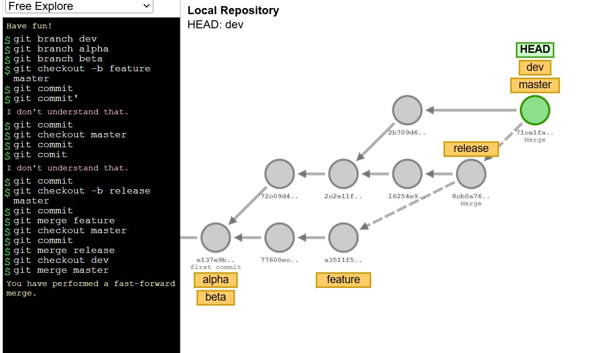

# Git Training - Aman Sir

## Introduction
This guide provides a structured approach to Git branch management and pull requests, ensuring smooth collaboration and workflow.

---

## GitHub Branches

### Branching Strategy
Creating separate branches for different purposes helps in organizing the development workflow.

### Creating branches
```bash
git branch dev  # Development branch
git branch alpha  # Alpha testing branch
git branch beta  # Beta testing branch
```
### Creating and switching to 'feature' branch and commit in the feature branch
```bash
git checkout -b feature master 
git commit -m "Initial commit in feature branch"
```

 ### Switching back to master branch and commit in the master branch
 ```bash
git checkout master 
git commit -m "Commit in master branch"
```
### Creating and switching to 'release' branch and commit in the release branch
```bash
git checkout -b release master  
git commit -m "Commit in release branch"
```
 ### Merging 'feature' branch into 'release'
 ```bash
git merge feature 
```
### Switching to master branch and merging release branch into master
```bash
git checkout master  
git merge release 
```
### Switching to 'dev' branch and merging master branch into dev
```bash
git checkout dev  
git merge master
```
### This Commands create below flow.

---

## Pull Request

### What is a Pull Request?
A pull request (PR) is a way to propose changes to a repository. It allows developers to review, discuss, and approve modifications before merging them into the main branch.

### Pull Request Workflow
First we create a branch and add one file in that branch. Now for mearge that feature branch into master branch we can see below step with screenshots.

Below are the screenshots representing the pull request process:

1. **Opening a Pull Request From feature branch**
   

2. **Comparing Changes in main branch**
   

3. **Setting a Ruleset for PR**
   

4. **Checking for Merge Conflicts**
   

5. **Approved Pull Request**
   

6. **After PR mearge Main branch**
   

---

## Conclusion
From this documentation we can understand how  branch and pull requests work in git. Using specified git command we can create a workflow which is shown in the image.

And in another part of this documnet we can see how branch and pull requests work. How merge branch and pull requests work.

